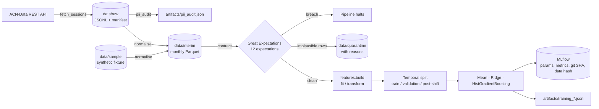
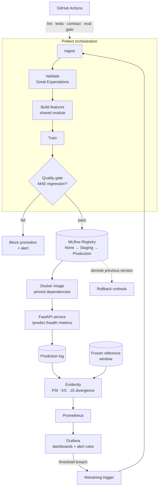

# Architecture

## V1 (Baseline) — implemented

Entry point: `python -m evcharge.pipeline --source sample|raw`.

### Why the stages are ordered this way

The contract sits **between** normalisation and feature building, so a schema breach halts
the run before any model sees the data. `tests/test_pipeline.py` asserts training does not
execute when the contract fails — ordering is enforced, not merely intended.

### Two sources, one code path

`--source sample` reads the committed synthetic fixture; `--source raw` reads the licensed
extract. Everything downstream is identical, so the demo path exercises the real pipeline
rather than a reduced copy of it.

## V2 (Final) — proposed

### What V1 already guarantees for V2

| V2 requirement | V1 foundation |
|---|---|
| Train/serve parity | `features.build` is already the single definition, with a parity test |
| Promotion gate | Temporal evaluation and baseline floors already produce the comparison metric |
| Drift reference window | `reference_window_start` is already declared in `configs/data.yaml` |
| Reproducible retraining | Partition writes are atomic; every run logs its input data hash |
| Detector ground truth | The March–April 2020 collapse is present, dated and measured |

### Drift detection design

A frozen reference window (2019-07 to 2020-02) is compared against each incoming monthly
batch on both input features and the prediction distribution.

| Signal | Metric | Threshold |
|---|---|---|
| `kWhDelivered` distribution | PSI | > 0.2 raises an alert |
| Feature distributions | KS test | p < 0.01 |
| Prediction distribution | Jensen-Shannon | reported alongside PSI |

The detector is then **validated rather than assumed**: it must fire on the known
March–April 2020 shift within one monthly batch, produce zero false alarms across the eight
preceding stable months, and its sensitivity floor is measured against SDV-generated
batches carrying injected drift of known magnitude.

### Rollback

1. Identify the last known-good version in the MLflow Registry.
2. Transition the current Production version to `Archived` and promote the previous one.
3. Redeploy the corresponding Docker image tag.
4. Confirm `/health` and verify drift metrics return to reference levels.

The procedure is written down so recovery does not depend on the original author being
available — the failure mode called out in the Stage-Pitfalls guide.

## Known gaps

- **Rolling site occupancy** is not a feature. It requires a point-in-time join against
  session history; deriving it from the batch would make a prediction depend on which other
  rows happen to be scored alongside it, breaking the parity guarantee.
- **Connected-duration prediction** is specified but not yet modelled; V1 covers
  `kWhDelivered` only.
- **The fixture's generative process is log-linear**, so tree ensembles have less to exploit
  there than on real data. Fixture metrics verify the pipeline, not model quality.
